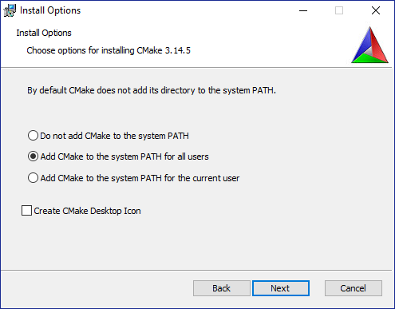
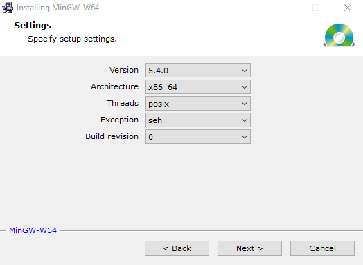

# Kinova-Setup
Testing Kinova Installation and basic C++ coding.

## Table of Contents

## Getting Started

### Setup
For a smooth installation process, please follow the instructions in the same order as given below.
#### Visual Studio Community
Download and install Visual Studio Community 2019. For the current version (2022) or older versions (< 2019), please refer to this <a href="https://visualstudio.microsoft.com/downloads/">link</a>.

#### CMake
Refere to the instructions <a href="https://cmake.org/install/">here</a> to install CMake depending on the platform you are using. For Windows users, please make sure that you select the option of adding CMake to the system PATH as shown below.

<p align="center">
  
</p>

(Check if it can be updated to the latest version 3.26.4.)

#### GCC Compiler
To install GCC 5.4 on Linux platform
```sh
sudo apt-get install build-essential
```

To install GCC 5.4 on Windows platform
Since GCC is not coded for the Windows OS, a GCC port of MinGW-w64 is required. The '-w64' suffix indicates that it can support both 32-bit and 64-bit environments.

The steps to install it are as follows:
1. Download the MinGW-w64 executable file from the folder above.
2. Start the installer and click **Next >** until you reach the installation options page
3. Here, ensure that the options look exactly like the image below.

<p align="center">
  
</p>

4. Click **Next >**. You might run into an error that says, **"The file has been downloaded incorrectly."** In this case, click **OK** and **Finish** to close the installation window.
5. To overcome the installation error, we need to add the path of the bin directory to the system path to make all the MinGW commands and tools available system wide. For this, follow the steps as shown in the video.

ADD VIDEO

(Check if file has to be downloaded from folder or website.)

<p align="right">(<a href="#readme-top">🔼 back to top</a>)</p>

#### Kinova Kortex API
Visit this link and download the latest version of kinova (Go to Code and download the zip file).

(Not sure if this step is even needed.)

ADD LINK

When following the link to Artifactory, to download the correct C++ API, you have to select the package for your architecture on the left-hand side tree view and then click Download on the right-hand side.

ADD IMAGE

### Build
#### CMakeList

#### Robotics Library

### Run

## Contributing

## License


