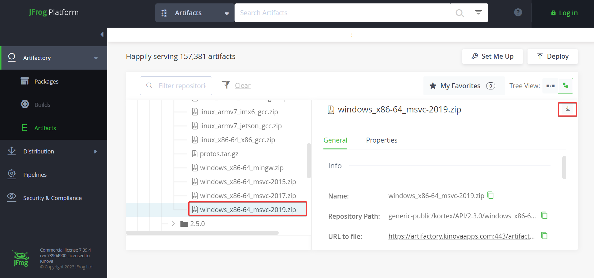
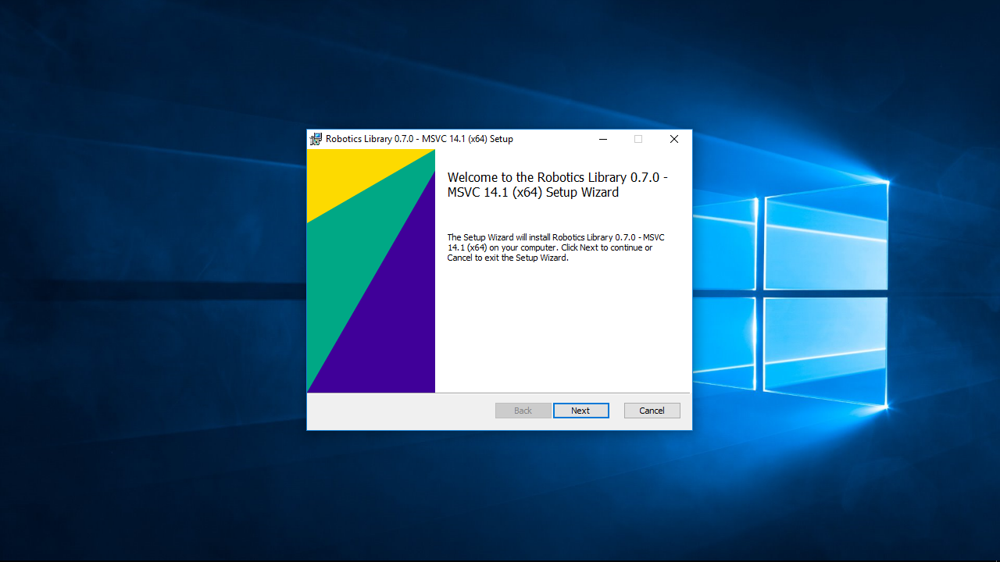
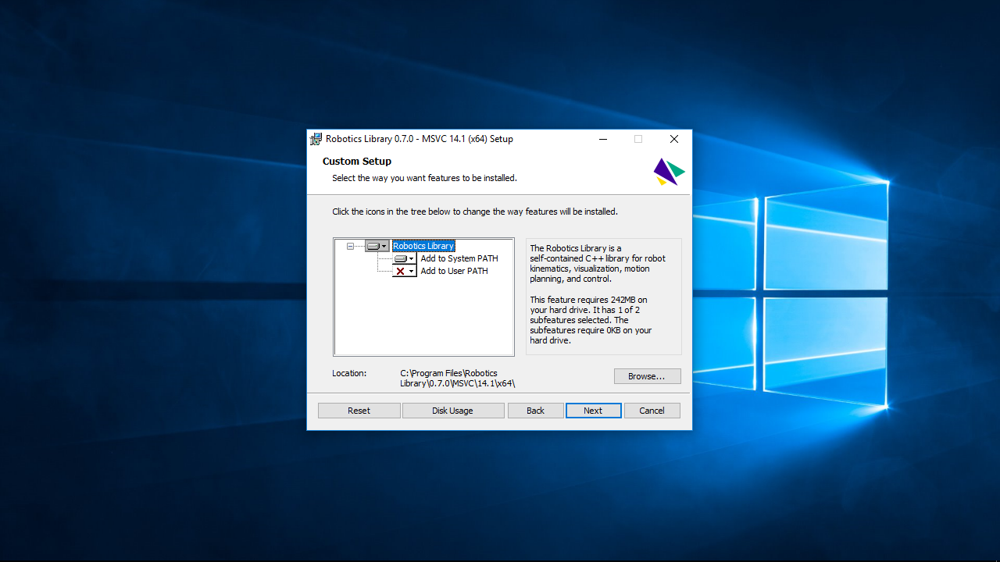
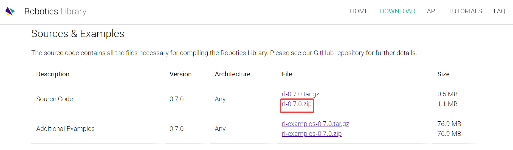

# Kinova-Setup
Testing Kinova Installation and basic C++ coding.

## Table of Contents

## Getting Started

### Setup
For a smooth installation process, please follow the instructions in the same order as given below.
#### Visual Studio Community
Download and install Visual Studio Community 2019. For the current version (2022) or older versions (< 2019), please refer to this <a href="https://visualstudio.microsoft.com/downloads/">link</a>.

---

#### CMake
Refere to the instructions <a href="https://cmake.org/install/">here</a> to install CMake depending on the platform you are using. For Windows users, please make sure that you select the option of adding CMake to the system PATH as shown below.

<p align="center">
  
</p>

(Check if it can be updated to the latest version 3.26.4.)

---

#### GCC Compiler
To install GCC 5.4 on Linux platform
```sh
sudo apt-get install build-essential
```

To install GCC 5.4 on Windows platform
Since GCC is not coded for the Windows OS, a GCC port of MinGW-w64 is required. The '-w64' suffix indicates that it can support both 32-bit and 64-bit environments.

The steps to install it are as follows:
1. Download the MinGW-w64 executable file from the folder above.
2. Start the installer and click **Next >** until you reach the installation options page
3. Here, ensure that the options look exactly like the image below.

<p align="center">
  
</p>

4. Click **Next >**. You might run into an error that says, **"The file has been downloaded incorrectly."** In this case, click **OK** and **Finish** to close the installation window.
5. To overcome the installation error, we need to add the path of the bin directory to the system path to make all the MinGW commands and tools available system wide. For this, follow the steps as shown in the video.

ADD VIDEO

(Check if file has to be downloaded from folder or website.)

---

#### Kinova Kortex API
Visit this <a href="https://github.com/Kinovarobotics/kortex">page</a> and download the latest version of the Kinova Kortex code.

ADD VIDEO

Next, we need to download the latest version of the Kortex API. For this, proceed to the <a href="https://artifactory.kinovaapps.com/ui/repos/tree/General/generic-public%2Fkortex%2FAPI%2F2.3.0%2Fwindows_x86-64_msvc-2019.zip">Artifactory</a> page. To download the correct C++ API, you have to select the package for your platform/architecture from the left-hand side and then click Download on the right-hand side.

<p align="center">
  
</p>

---

### Build
#### CMakeList
Download the **CMakeLists.txt** file from the corresponding folder above and replace it in the following directory in the Kinova Kortex code folder you downloaded earlier:

📦api_cpp
 ┣ 📂doc
 ┗ 📂examples
    ┣ 📜CMakeLists.txt
    ┣ 📜readme.md
    ┣ 📜utilities.cpp
    ┗ 📜utilities.h

---

#### Robotics Library

The Robotics Library has many features which are included in the all-in-one installer for your convenience.

Follow the steps given below to install and build the robotics library.

1. Download the Windows instlaller from this <a href="https://www.roboticslibrary.org/download">page</a>.

2. Start the installer setup (you might need to run it as an administrator).

<p align="center">
  
</p>

<p align="center">
  
</p>

3. Now, we need to make sure that we set the **PATH** and **CMAKE_PREFIX_PATH** environment variables accordingly. For this, run these commands:
```sh
set PATH=C:\Program Files\Robotics Library\0.7.0\MSVC\14.1\x64\bin;%PATH%
set CMAKE_PREFIX_PATH=C:\Program Files\Robotics Library\0.7.0\MSVC\14.1\x64;%CMAKE_PREFIX_PATH%
```

4. For multi core compilation support, run the following commands:
```sh
set VCBUILD_DEFAULT_OPTIONS=/M%NUMBER_OF_PROCESSORS%
set CL=/MP
```

5. Next, we need to download the source code. You can download it from <a href="https://www.roboticslibrary.org/download">here</a> or visit their <a href="https://github.com/roboticslibrary/rl">Github page</a> for the latest version of the code.

<p align="center">
  
</p>

6. Unzip the folder.

7. We now need to use the CMake GUI to build from the folder we just downloaded.

ADD IMAGE

8. Finally, open Visual Studio 2019 and open the ".\kortex-master\api_cpp\examples" folder. Build Cmake by going to ADD DIRECTION.

---

### Run
ADD EXAMPLE CODE TO TEST IF INSTALLATION IS SUCCESSFULLY DONE.

---

## Contributing
Contributions are always welcome. If you have any suggestions to improve the instructions written here, please follow the steps given below. If you do not have any definite changes to make and would like to comment or discuss about any particular content, please feel free to open an issue with the **enhancement** tag.

1. Create a fork of the project.
2. Clone the fork on your local machine.
3. Create a new branch to work on.
4. Create a new markdown file with your username as the file name.
5. Add a description of changes you would like and save the file.
4. Commit your changes with the proper message.
5. Push your branch to the fork.
6. From your fork, open a pull request and wait for approval.

(Check these instructions with Harsha.)

---

## License
This project is licensed under the [NAME HERE] License - see the LICENSE.md file for details.

<p align="right">(<a href="#readme-top">🔼 Back to Top</a>)</p>


